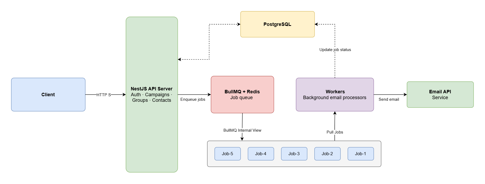
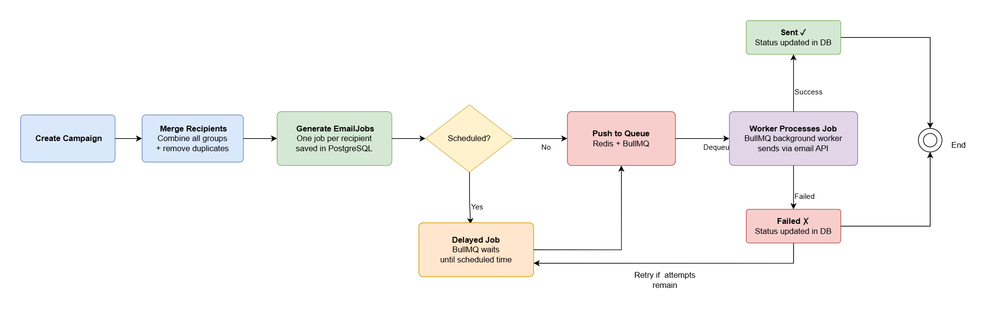
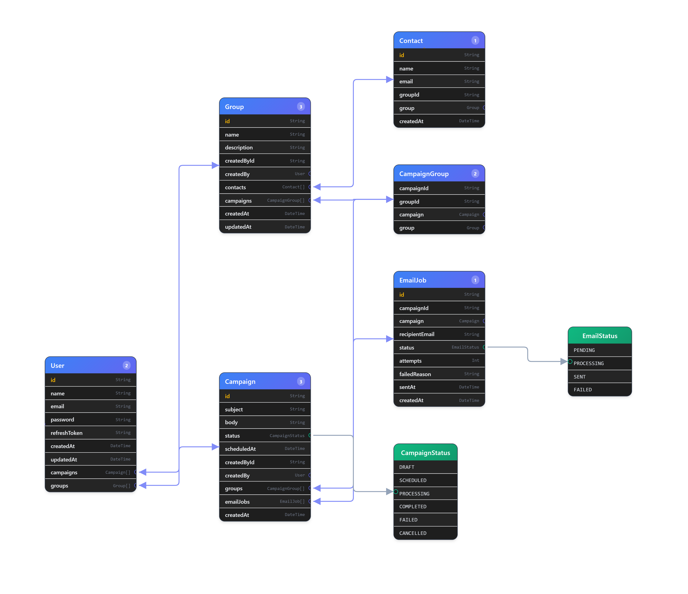
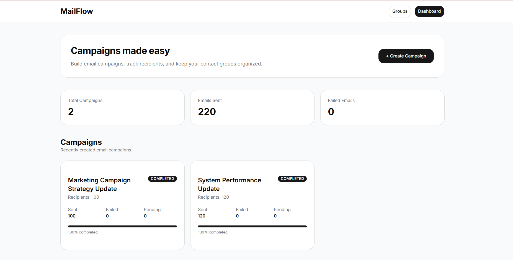
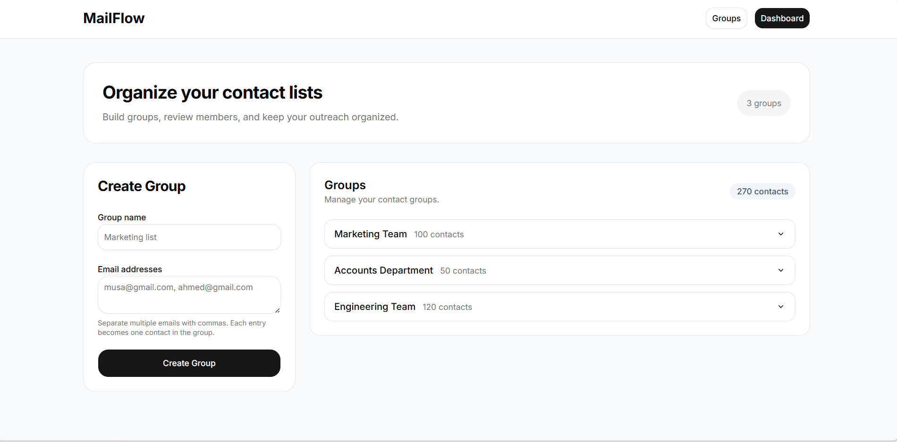
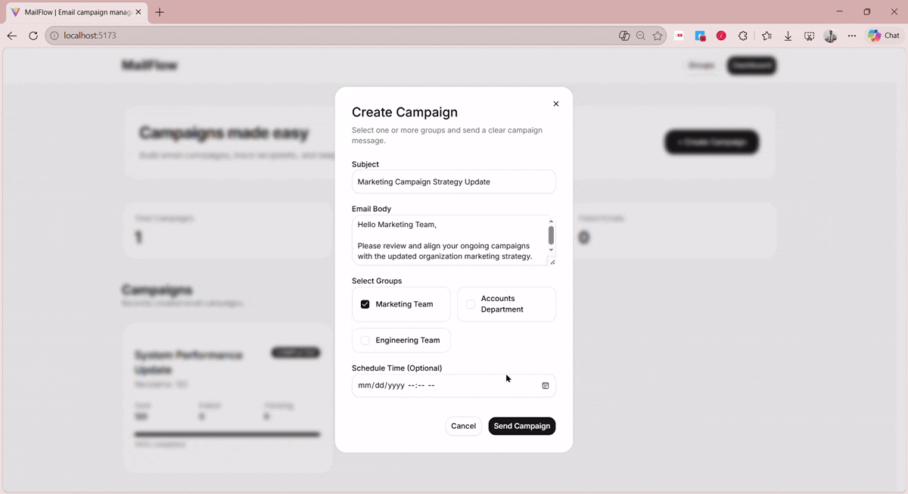

<div align="center">


# MailFlow

**Scalable Queue-Based Email Delivery and Campaign Management System**

[](<!-- ADD CLIENT URL -->)

<!-- [](ADD VIDEO URL) -->

</div>

## Table of Contents

1. [Overview](#1-overview)
2. [Features](#2-features)
3. [Tech Stack](#3-tech-stack)
4. [System Architecture](#4-system-architecture)
5. [Email Processing Workflow](#5-email-processing-workflow)
6. [Database Models](#6-database-models)
7. [Screenshots](#7-screenshots)
8. [Project Structure](#8-project-structure)
9. [Installation & Setup](#9-installation--setup)
10. [API Reference](#10-api-reference)
11. [Deployment](#11-deployment)
12. [Challenges](#12-challenges)
13. [Engineering Highlights](#13-engineering-highlights)
14. [Future Improvements](#14-future-improvements)

# 1. Overview

MailFlow is a queue-based bulk email delivery system designed to send emails reliably and efficiently at scale. Instead of processing emails directly within HTTP requests, the system uses a job queue (BullMQ + Redis) to offload email sending to background workers, ensuring fast API responses and stable performance.

Users can create email campaigns, organize recipients into groups, add custom recipients, and schedule emails for later delivery. Each campaign is broken down into individual email jobs, which are processed asynchronously and tracked through states such as pending, processing, sent, and failed.

The project is built to demonstrate real-world backend engineering concepts including asynchronous processing, queue-based architecture, worker systems, and scalable system design.

# 2. Features

| #   | Feature                    | Description                                                             |
| --- | -------------------------- | ----------------------------------------------------------------------- |
| 1   | Authentication             | JWT-based authentication with refresh token support                     |
| 2   | Campaign Management        | Create, update, schedule, and manage email campaigns                    |
| 3   | Group & Contact Management | Organize recipients into groups and manage contacts                     |
| 4   | Bulk Email Processing      | Queue-based asynchronous email processing using BullMQ                  |
| 5   | Background Workers         | Dedicated workers for processing and sending emails                     |
| 6   | Scheduled Email Delivery   | Schedule campaigns for future execution using delayed jobs              |
| 7   | Email Status Tracking      | Track email states: pending, processing, sent, failed                   |
| 8   | Progress Monitoring        | Monitor campaign delivery progress in real time                         |
| 9   | Retry Mechanism            | Automatic retry handling for failed email deliveries                    |
| 10  | Scalable Architecture      | Built with queue-based design for handling high-volume email processing |

# 3. Tech Stack

**Client:** TypeScript, React, TailwindCSS, Shadcn/ui, Axios

**Server:** NestJS, PostgreSQL, Prisma ORM, BullMQ, Redis, JWT Authentication

# 4. System Architecture



A high-level overview of the frontend, backend, queue system, Redis, workers, and email service.

# 5. Email Processing Workflow



The workflow demonstrates how campaigns are transformed into individual email jobs and processed asynchronously through BullMQ workers.

# 6. Database Models



# 7. Screenshots

## 7.1 Dashboard



## 7.2 Groups Management



## 7.3 Create Campaign and Progress Tracking



# 8. Project Structure

```txt
mailflow/
│
├── client/
│   └── src/
│       ├── api/
│       ├── components/
│       ├── pages/
│       ├── routes/
│       ├── hooks/
│       └── utils/
│
└── server/
    ├── prisma/
    │   └── schema.prisma
    │
    └── src/
        ├── auth/
        ├── campaigns/
        ├── contacts/
        ├── groups/
        ├── queue/
        ├── workers/
        ├── mail/
        └── common/
```

# 9. Installation & Setup

- Prerequisites: Node.js v18+, PostgreSQL, Redis.
- This repository uses `server/` for the backend and `client/` for the frontend.

- Clone repository and install dependencies:

```bash
git clone <YOUR_REPOSITORY_URL>
cd mailflow
cd server
npm install
cd ../client
npm install
```

- Configure backend environment variables:

```bash
cd server
cp .env.example .env
```

- Update `server/.env` using the example values in `server/.env.example`.

- Configure frontend environment variables:

```env
VITE_API_URL=http://localhost:3000
```

- Set up the database:

```bash
cd server
npx prisma migrate dev
```

- Start Redis:

```bash
redis-server
```

- Run backend:

```bash
cd server
npm run start:dev
```

- Run frontend:

```bash
cd client
npm run dev
```

# 10. API Reference

## Authentication

| Method | Endpoint       | Description                  |
| ------ | -------------- | ---------------------------- |
| POST   | /auth/register | Register a new user          |
| POST   | /auth/login    | Login user                   |
| POST   | /auth/refresh  | Refresh access token         |
| POST   | /auth/logout   | Logout user and clear cookie |

## Groups

| Method | Endpoint    | Description       |
| ------ | ----------- | ----------------- |
| POST   | /groups     | Create group      |
| GET    | /groups     | Get all groups    |
| GET    | /groups/:id | Get group details |
| PATCH  | /groups/:id | Update group      |
| DELETE | /groups/:id | Delete group      |

## Contacts

| Method | Endpoint      | Description    |
| ------ | ------------- | -------------- |
| POST   | /contacts     | Create contact |
| GET    | /contacts     | Get contacts   |
| GET    | /contacts/:id | Get contact    |
| PATCH  | /contacts/:id | Update contact |
| DELETE | /contacts/:id | Delete contact |

## Campaigns

| Method | Endpoint       | Description          |
| ------ | -------------- | -------------------- |
| POST   | /campaigns     | Create campaign      |
| GET    | /campaigns     | Get campaigns        |
| GET    | /campaigns/:id | Get campaign details |
| PATCH  | /campaigns/:id | Update campaign      |
| DELETE | /campaigns/:id | Delete campaign      |

## Mail / Email Jobs

| Method | Endpoint  | Description          |
| ------ | --------- | -------------------- |
| POST   | /mail     | Create mail job      |
| GET    | /mail     | Get mail jobs        |
| GET    | /mail/:id | Get mail job details |
| PATCH  | /mail/:id | Update mail job      |
| DELETE | /mail/:id | Delete mail job      |

# 11. Deployment

- Frontend: Deployed on Netlify (React build with Vite)
- Backend: Deployed on Railway (NestJS API + workers)
- Queue (Redis): Railway Redis or Upstash Redis for BullMQ job processing
- Database: Railway PostgreSQL

# 12. Challenges

- Designing a queue-based architecture instead of synchronous email delivery
- Handling recipient deduplication when combining groups and custom emails
- Managing scheduled email delivery through delayed jobs
- Tracking delivery progress efficiently for thousands of email jobs
- Updating campaign progress without introducing unnecessary server load

# 13. Engineering Highlights

- Queue-based architecture using BullMQ and Redis
- Background workers for asynchronous email processing
- Scheduled email delivery using delayed jobs
- Campaign progress tracking through EmailJob aggregation
- Recipient deduplication before job generation
- Modular NestJS architecture
- JWT authentication with protected APIs
- Relational data modeling using Prisma and PostgreSQL
- Separation of API requests and background processing

# 14. Future Improvements

- [ ] CSV contact import
- [ ] Campaign analytics dashboard
- [ ] WebSocket live updates
- [ ] Multi-organization support

<div align="center">

## License

This project is licensed under the MIT License.

</div>
